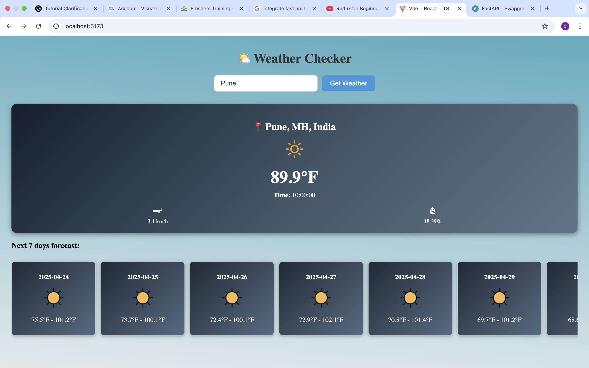
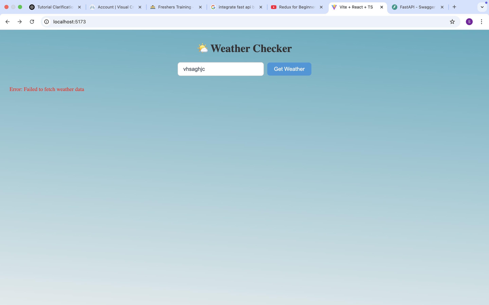

<<<<<<< HEAD
# Weather App

A sleek weather forecasting app built with React and modern APIs. Enter any city and get the **current weather** plus a **7-day forecast** — all displayed in a clean, responsive UI.

---

## Features

- Search weather by city name
- Current weather details (temperature, humidity, condition, windspeed, etc.)
- 7-day forecast
- Responsive design for all screen sizes

---

## Screenshots

###





## Setup

### 1. Clone the Repository

```bash
git clone https://github.com/srajna13/WeatherApp
cd weather_app
npm install
```
### 2. Create a .env and add Api Key 
Add visual Crossing Weather Api key
```bash
api_key=your_api_key
```
### 3. Run the server
```bash
npm run dev
```
=======
>>>>>>> 770c2fd (env)
